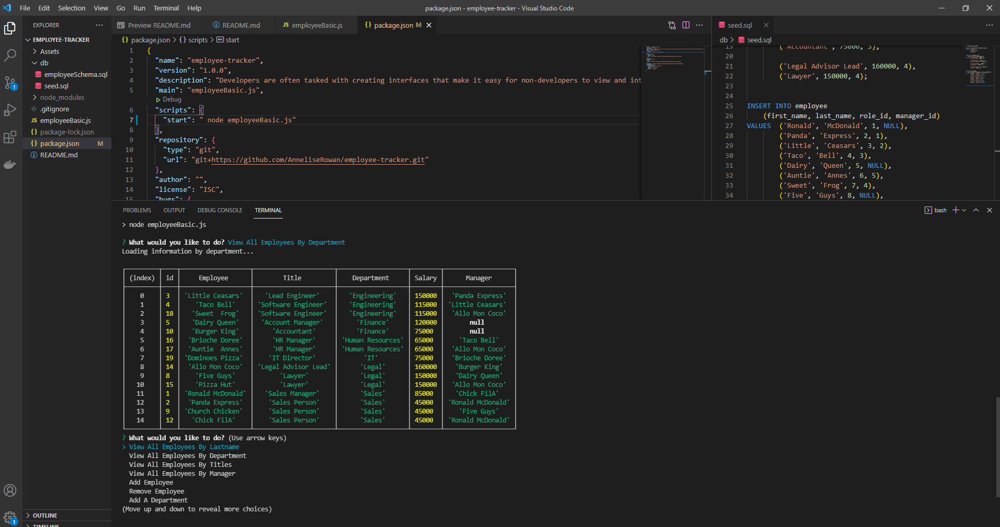

# MySQL Employee-Tracker

Developed a **C**ontent **M**anagement **S**ystems as a solution for managing a company's employees using node, inquirer, and MySQL.

## Owned By

Annelise Rowan

## About
  
A command-line application that allows the user to:

  * Add departments, roles, employees

  * View departments, roles, employees

  * Update employee roles

  * Update employee managers

  * View employees by manager

  * Delete departments, roles, and employees

  * View the total utilized budget of a department -- ie the combined salaries of all employees in that department

## Demo

Here is a link to a video of the application : 
